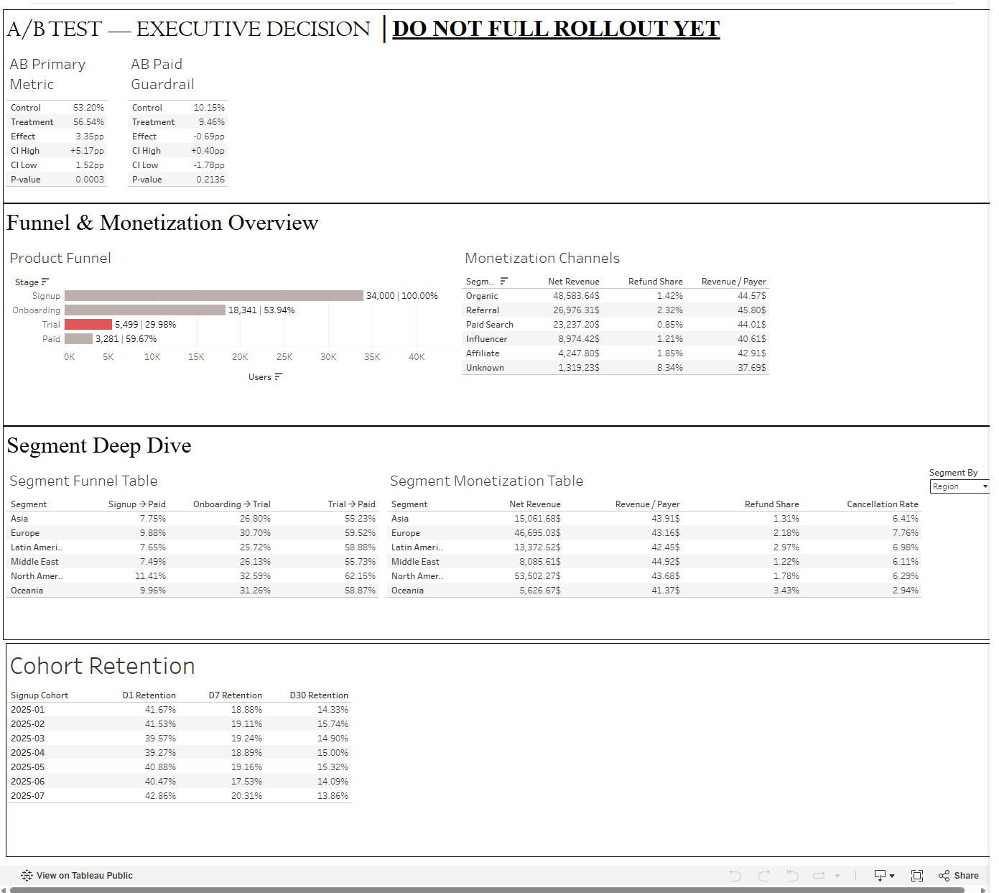

# Mobile Subscription Product Analytics

Product analytics portfolio case study for a mobile subscription app.

The project investigates the complete new-user journey from registration to paid subscription, identifies funnel bottlenecks, compares user segments, measures cohort retention and monetization, and evaluates an onboarding A/B test.

> The dataset is realistic synthetic data created for portfolio and educational purposes. It does not contain real customer information.

---

## Business Problem

A mobile subscription app is acquiring a large number of new users, but paid subscriber growth is not keeping pace.

The product team wants to understand:

1. Where users drop out between signup, onboarding, trial and paid subscription.
2. Which acquisition, device, platform, geographic and behavioral segments perform differently.
3. How D1, D7 and D30 retention develops across signup cohorts.
4. How trial conversion, cancellations and revenue vary across segments.
5. Whether a new onboarding flow should be rolled out after an A/B test.

---

## Dataset

The analysis uses five core tables:

- `users` — registration and user attributes
- `events` — product behavior and app activity
- `subscriptions` — trial and subscription lifecycle
- `payments` — charges and refunds
- `experiment_assignments` — A/B test allocation

Dataset scale:

- **34,000 registered users**
- **~803K raw events**
- **5,508 subscriptions**
- **~8.4K payment records**
- **~11.6K experiment assignment records**

The observation period covers user signups from January through July 2025, with product and commercial activity observed through August 15, 2025.

---

## Data Quality & Preparation

Before calculating business metrics, the raw data was audited for:

- primary-key uniqueness
- duplicate records
- missing identifiers
- orphan foreign keys
- subscription lifecycle consistency
- payment chronology
- experiment assignment conflicts
- event-to-user identity resolution

Important findings included:

- duplicate event records were exact duplicates rather than conflicting versions
- duplicate payment rows were removed
- anonymous IDs were used to recover missing event-level `user_id` values where possible
- users assigned to conflicting A/B variants were excluded from experiment analysis

Reusable analytical views were created for cleaned events, payments, resolved event users and experiment assignments.

See [`sql/01_data_quality.sql`](sql/01_data_quality.sql).

---

## Metric Definitions

### Funnel

The ordered user funnel is:

**Signup → Onboarding Completed → Trial Started → Paid**

A user is counted at a later step only if the previous funnel step occurred first.

### Retention

Retention is based on an `app_open` event on the exact calendar day relative to signup:

- **D1** — app open exactly 1 day after signup
- **D7** — app open exactly 7 days after signup
- **D30** — app open exactly 30 days after signup

Only users with a complete observation window are included in each denominator.

### Monetization

- **Gross Revenue** — captured positive charge transactions
- **Refunds** — captured negative refund transactions
- **Net Revenue** — captured revenue after refunds
- **Trial → Paid** — paying users divided by trial starters
- **Cancellation Rate** — paid users with a recorded cancellation
- **Revenue / Payer** — net revenue divided by paying users

Revenue should not be interpreted as profit because cost and marketing-spend data are not available.

---

# Key Findings

## 1. Product Funnel

| Funnel Step | Users | Conversion from Previous Step |
|---|---:|---:|
| Signup | 34,000 | 100.00% |
| Onboarding Completed | 18,341 | 53.94% |
| Trial Started | 5,499 | 29.98% |
| Paid | 3,281 | 59.67% |

The largest **absolute user loss** occurs between signup and onboarding.

However, the largest **percentage bottleneck** occurs between:

**Onboarding → Trial: only 29.98% conversion**

This means approximately 70% of users who complete onboarding do not start a trial.

See [`sql/02_funnel.sql`](sql/02_funnel.sql).

---

## 2. Segment Analysis

Funnel performance was compared across:

- acquisition channel
- region
- platform
- device tier
- primary goal

Several patterns emerged:

- **Referral traffic** showed comparatively strong funnel performance.
- **Paid Social** performed weakly across multiple funnel stages.
- **iOS** users converted better than Android users.
- **Low-tier devices** showed weaker onboarding, trial and paid conversion.
- Geographic differences exist, although no single region explains the entire product-level funnel problem.

The consistency of the onboarding-to-trial drop across many segments suggests that the core problem is primarily **systemic rather than isolated to one audience**.

See [`sql/03_segmentation.sql`](sql/03_segmentation.sql).

---

## 3. Retention

Overall exact-day retention:

| Metric | Retention |
|---|---:|
| D1 | **41.01%** |
| D7 | **19.07%** |
| D30 | **14.73%** |

The largest retention decline occurs between **D1 and D7**.

Monthly cohorts remain relatively stable, with no single cohort showing a dramatic structural break.

This suggests that early retention is a persistent product challenge rather than a temporary acquisition or cohort anomaly.

See [`sql/04_retention.sql`](sql/04_retention.sql).

---

## 4. Monetization

Overall monetization performance:

| Metric | Result |
|---|---:|
| Trial Users | 5,499 |
| Paying Users | 3,281 |
| Trial → Paid | **59.67%** |
| Paid Cancellation Rate | **6.71%** |
| Gross Revenue | **$145,262.81** |
| Refunds | **$2,919.03** |
| Net Revenue | **$142,343.78** |
| Refund Share | **2.01%** |
| Net Revenue / Payer | **$43.38** |

Revenue per payer is relatively similar across major segments, meaning total revenue differences are driven primarily by **user volume and conversion**, rather than large differences in payer value.

Paid Social is particularly important to monitor because it combines relatively weak funnel performance with lower monetization quality than several other acquisition channels.

See [`sql/05_monetization.sql`](sql/05_monetization.sql).

---

# A/B Test — `onboarding_flow_v2`

The experiment compared:

- **Control** — existing onboarding flow
- **Treatment** — shorter revised onboarding flow

The analysis follows an **intention-to-treat (ITT)** approach.

A Sample Ratio Mismatch check found no evidence of abnormal allocation between control and treatment.

## Primary Metric — Onboarding Completion

| Group | Rate |
|---|---:|
| Control | 53.20% |
| Treatment | 56.54% |

**Treatment effect: +3.35 percentage points**

- Relative uplift: approximately **+6.3%**
- 95% CI: approximately **[+1.52 pp, +5.17 pp]**
- p-value: **0.0003**

The treatment produced a statistically significant improvement in the experiment's primary metric.

---

## Paid Conversion Guardrail

| Group | Paid Conversion |
|---|---:|
| Control | 10.15% |
| Treatment | 9.46% |

**Observed effect: -0.69 percentage points**

95% CI:

**[-1.78 pp, +0.40 pp]**

The result is not statistically significant, but the confidence interval still includes economically meaningful negative effects.

Therefore, the experiment does **not provide sufficient evidence that paid conversion is protected at tighter business guardrails**.

Secondary metrics were evaluated using Holm correction for multiple comparisons. No downstream improvement was statistically confirmed after adjustment.

---

## Experiment Decision

### DO NOT FULL ROLLOUT YET

The new onboarding flow clearly improves onboarding completion, but the improvement has not yet been shown to propagate reliably into downstream commercial outcomes.

A full rollout would therefore be premature.

Recommended next step:

- continue or prospectively extend the experiment
- define an explicit acceptable paid-conversion guardrail
- collect enough observations to evaluate downstream effects with adequate precision
- consider a staged rollout rather than immediate 100% deployment

The Python statistical analysis includes:

- Sample Ratio Mismatch testing
- two-proportion z-tests
- 95% confidence intervals
- Holm multiple-testing correction
- paid-conversion guardrail sensitivity analysis

See:

- [`sql/06_ab_test_dataset.sql`](sql/06_ab_test_dataset.sql)
- [`python/ab_test_analysis.ipynb`](python/ab_test_analysis.ipynb)

---

# Dashboard

The Tableau dashboard summarizes:

- A/B test decision
- product funnel
- monetization by acquisition channel
- dynamic segment comparison
- cohort retention



The Segment Deep Dive section includes an interactive selector for:

- Region
- Acquisition Channel
- Platform
- Device Tier
- Primary Goal

---

## Project Structure

```text
mobile-subscription-product-analytics/
│
├── README.md
│
├── sql/
│   ├── 01_data_quality.sql
│   ├── 02_funnel.sql
│   ├── 03_segmentation.sql
│   ├── 04_retention.sql
│   ├── 05_monetization.sql
│   └── 06_ab_test_dataset.sql
│
├── python/
│   └── ab_test_analysis.ipynb
│
├── data/
│   ├── ab_test_dataset.csv
│   └── ab_test_results.csv
│
└── dashboard/
    └── dashboard.png
